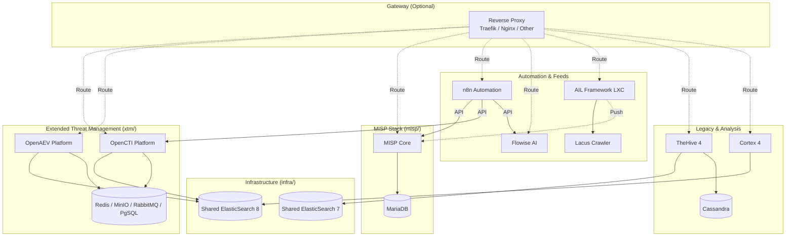

# ThreatLabs Homelab CTI Stack

A comprehensive Cyber Threat Intelligence (CTI) stack running on Docker, designed for homelab usage.

## Architecture

This repository is organized into modular stacks that share common infrastructure.



### Directory Structure

* **`infra/`**: **Core Infrastructure**. Hosts shared **ElasticSearch** (v7 & v8), **PostgreSQL 17**, and **Valkey** (Redis).
* **`proxy/`**: **Traefik Proxy**. Shared reverse proxy for accessing services via subdomains.
* **`xtm/`**: **Extended Threat Management**. Hosts OpenCTI, OpenAEV, and their connectors. Depends on `infra`.
* **`misp/`**: **Malware Information Sharing Platform**. Hosting MISP Core, Modules, and Guard.
* **`cortex/`**: **Observable Analysis**. Cortex 4, depends on `infra` (ES8).
* **`n8n/`** & **`flowise/`**: **Automation**. Workflow automation and LLM chains.
* **`flowintel/`**: **Case Management**. Lightweight alternative to TheHive.
* **`lacus/`**: **Crawling**. AIL Framework crawler (Playwright-based).
* **`thehive/`**: **Legacy Case Management**. TheHive 4, depends on `infra` (ES7).
* **`ail-project/`**: **Dark Web Analysis**. Instructions for deploying AIL Framework in a separate LXC.
* **`openclaw/`**: **AI Agent**. Self-hosted AI agent with Docker support.

### Shared Network

All stacks communicate via an external Docker network named `cti-net`.

> [!TIP]
> See [TROUBLESHOOTING.md](TROUBLESHOOTING.md) for network, permission, and common boot issues.

## Factory Reset

If you need to completely wipe the stack and start over (delete all data):

1. Run the reset script:

    ```bash
    chmod +x reset.sh
    ./reset.sh
    ```

2. Type `NUKE` when prompted.
3. Run `./setup.sh` to re-initialize the environment.

## Getting Started

### 1. Pre-requisites

Ensure Docker and Docker Compose are installed.

If cloning for the first time:

```bash
git clone --recurse-submodules https://github.com/JazenaYLA/threatlabs-cti-stack.git
```

(If you forgot `--recurse-submodules`, simply run `./setup.sh` and it will fix it).

### 2. (Optional) For Dockge Users

If you are managing your stacks with **Dockge**, you can use the `setup-dockge.sh` script to symlink these stacks into your Dockge directory (default `/opt/stacks`).

> [!NOTE]
> `setup.sh` is **MANDATORY** for everyone as it creates the necessary docker network (`cti-net`) and volumes.
> `setup-dockge.sh` is **OPTIONAL** and only for users who want to see these stacks in their Dockge dashboard.

```bash
sudo ./setup-dockge.sh
```

### 3. Configuration

Run the setup script to prepare networks, volumes, and generate environment files:

```bash
./setup.sh
```

**What the script does:**

1. Creates the shared network `cti-net`.
2. Creates necessary docker volumes.
3. **Generates `.env` files** for all stacks from templates.
    * For **OpenCTI (xtm)**, it automatically generates unique UUIDv4 tokens for all connectors.
4. **Pauses** to allow you to review and edit the generated `.env` files.

**Action Required:**
When the script pauses, open the `.env` files in each directory (e.g., `infra/.env`, `xtm/.env`) and set your specific secrets (passwords, API keys, domains).

> [!IMPORTANT]
>
> * **infra/.env**: Verify `ES_HEAP_SIZE_GB` fits your host's RAM.
> * **xtm/.env**: Review generated UUIDs. If you are migrating an existing OpenCTI instance, you may need to replace these with your potential existing connector IDs.

> [!IMPORTANT]
> Ensure you verify the `ES_HEAP_SIZE_GB` in `infra/.env` fits your host's available RAM.

1. Startup Order

The services must be started in a specific order to ensure database availability.

1. **Start Infrastructure Stack (REQUIRED FIRST)**

1. **Start Infrastructure Stack (REQUIRED FIRST)**

    * **CLI**: `cd infra && docker compose up -d`
    * **Dockge**: Go to `/opt/stacks` (Dashboard), select `infra`, and click **Active** / **Update**.

    *Wait for ElasticSearch clusters to be fully healthy.*

1. **Start Proxy (Optional but Recommended)**

    ```bash
    cd proxy && docker compose up -d
    ```

1. **Start Application Stacks**

    > **Cortex Users**: First run the index setup script (required for ES8):
>
    > ```bash
    > cd cortex && ./create-cortex-index.sh && cd ..
    > ```

    You can start the stacks in any order:

    * **OpenCTI / OpenAEV**: `cd xtm && docker compose up -d`
    * **MISP**: `cd misp && docker compose up -d`
    * **Cortex**: `cd cortex && docker compose up -d`
    * **n8n**: `cd n8n && docker compose up -d`
    *   **OpenCTI / OpenAEV**: `cd xtm && docker compose up -d`
    *   **MISP**: `cd misp && docker compose up -d`
    *   **Cortex**: `cd cortex && docker compose up -d`
    *   **n8n**: `cd n8n && docker compose up -d`
    *   **Flowise**: `cd flowise && docker compose up -d`
    *   **FlowIntel**: `cd flowintel && docker compose up -d`
    *   **Lacus**: `cd lacus && docker compose up -d`
    *   **OpenClaw**:
        ```bash
        cd openclaw
        docker compose up -d --build
        ```
        > **Note**: To install extra system tools (e.g., `ffmpeg`), add `OPENCLAW_DOCKER_APT_PACKAGES="ffmpeg"` to `.env` and rebuild.

        ```bash
        # REQUIRED: Initial Onboarding
        docker compose run --rm openclaw-cli onboard --no-install-daemon

        # INTERACTIVE PROMPTS CHEAT SHEET:
        # 1.  Risk Acknowledgement? -> Yes
        # 2.  Onboarding mode? -> **Manual**  <-- CRITICAL (QuickStart forces 127.0.0.1)
        # 3.  Model/Auth Provider? -> **Skip** (or enter your OpenAI/Anthropic key)
        # 4.  Gateway bind? -> **LAN** (0.0.0.0)
        # 5.  Gateway auth? -> Token (Press Enter)
        # 6.  Tailscale exposure? -> Off
        # 7.  Configure chat channels? -> **No** (Skip for now, configure later via CLI)
        # 8.  Configure skills? -> **No** (Skip for now)
        # 9.  Install shell completion? -> No
        ```
    *   **AIL Project**: See [ail-project/README.md](ail-project/README.md) for LXC deployment.

## Notes

* **Networks**: Ensure the `cti-net` network exists or let the `infra` stack create it (if configured to do so, otherwise create manually: `docker network create cti-net`).
