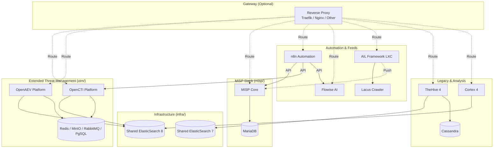

# ThreatLabs Homelab CTI Stack

A comprehensive Cyber Threat Intelligence (CTI) stack running on Docker, designed for homelab usage.

## Architecture

This repository is organized into modular stacks that share common infrastructure.



### Directory Structure

* **`infra/`**: **Core Infrastructure**. Hosts shared **ElasticSearch** (v7 & v8), **PostgreSQL 17**, and **Valkey** (Redis).
* **`proxy/`**: **Traefik Proxy**. Shared reverse proxy for accessing services via subdomains.
* **`xtm/`**: **Extended Threat Management**. Hosts OpenCTI, OpenAEV, and their connectors. Depends on `infra`.
* **`misp/`**: **Malware Information Sharing Platform**. Hosting MISP Core, Modules, and Guard.
* **`cortex/`**: **Observable Analysis**. Cortex 4, depends on `infra` (ES8).
* **`n8n/`** & **`flowise/`**: **Automation**. Workflow automation and LLM chains.
* **`flowintel/`**: **Case Management**. Lightweight alternative to TheHive.
* **`lacus/`**: **Crawling**. AIL Framework crawler (Playwright-based).
* **`thehive/`**: **Legacy Case Management**. TheHive 4, depends on `infra` (ES7).
* **`ail-project/`**: **Dark Web Analysis**. Instructions for deploying AIL Framework in a separate LXC.
* **`openclaw/`**: **AI Agent**. Self-hosted AI agent with Docker support.

### Shared Network

All stacks communicate via an external Docker network named `cti-net`.

> [!TIP]
> See [TROUBLESHOOTING.md](TROUBLESHOOTING.md) for network, permission, and common boot issues.

## Factory Reset

If you need to completely wipe the stack and start over (delete all data):

1. Run the reset script:

    ```bash
    chmod +x reset.sh
    ./reset.sh
    ```

2. Type `NUKE` when prompted.
3. Run `./setup.sh` to re-initialize the environment.

## Getting Started

### 1. Pre-requisites

Ensure Docker and Docker Compose are installed.

### 2. Configuration

Run the setup script to prepare networks and volumes:

```bash
./setup.sh
```

**For Dockge Users:**
If you use Dockge, you can automatically link these stacks to your `/opt/stacks` directory:

```bash
sudo ./setup-dockge.sh
```

Navigate to each directory and create your environment file from the example:

```bash
# Infrastructure
cp infra/.env.example infra/.env
# Edit infra/.env

# OpenCTI / OpenAEV
cp xtm/.env.example xtm/.env
# Edit xtm/.env

# MISP
cp misp/template.env misp/.env
# Edit misp/.env

# Cortex
cp cortex/.env.example cortex/.env

# n8n
cp n8n/.env.example n8n/.env

# Flowise
cp flowise/.env.example flowise/.env

# FlowIntel
cp flowintel/.env.example flowintel/.env

# TheHive (Legacy)
cp thehive/.env.example thehive/.env

# Lacus
cp lacus/.env.example lacus/.env

# AIL Project
cp ail-project/.env.example ail-project/.env
```

> [!IMPORTANT]
> Ensure you verify the `ES_HEAP_SIZE_GB` in `infra/.env` fits your host's available RAM.

1. Startup Order

The services must be started in a specific order to ensure database availability.

1. **Start Infrastructure Stack (REQUIRED FIRST)**

1. **Start Infrastructure Stack (REQUIRED FIRST)**

    * **CLI**: `cd infra && docker compose up -d`
    * **Dockge**: Go to `/opt/stacks` (Dashboard), select `infra`, and click **Active** / **Update**.

    *Wait for ElasticSearch clusters to be fully healthy.*

1. **Start Proxy (Optional but Recommended)**

    ```bash
    cd proxy && docker compose up -d
    ```

1. **Start Application Stacks**

    > **Cortex Users**: First run the index setup script (required for ES8):
>
    > ```bash
    > cd cortex && ./create-cortex-index.sh && cd ..
    > ```

    You can start the stacks in any order:

    * **OpenCTI / OpenAEV**: `cd xtm && docker compose up -d`
    * **MISP**: `cd misp && docker compose up -d`
    * **Cortex**: `cd cortex && docker compose up -d`
    * **n8n**: `cd n8n && docker compose up -d`
    * **Flowise**: `cd flowise && docker compose up -d`
    * **FlowIntel**: `cd flowintel && docker compose up -d`
    *   **Lacus**: `cd lacus && docker compose up -d`
    *   **OpenClaw**: `cd openclaw && docker compose up -d` (Builds from source, may take time)
    *   **AIL Project**: See [ail-project/README.md](ail-project/README.md) for LXC deployment.

## Notes

* **Networks**: Ensure the `cti-net` network exists or let the `infra` stack create it (if configured to do so, otherwise create manually: `docker network create cti-net`).
