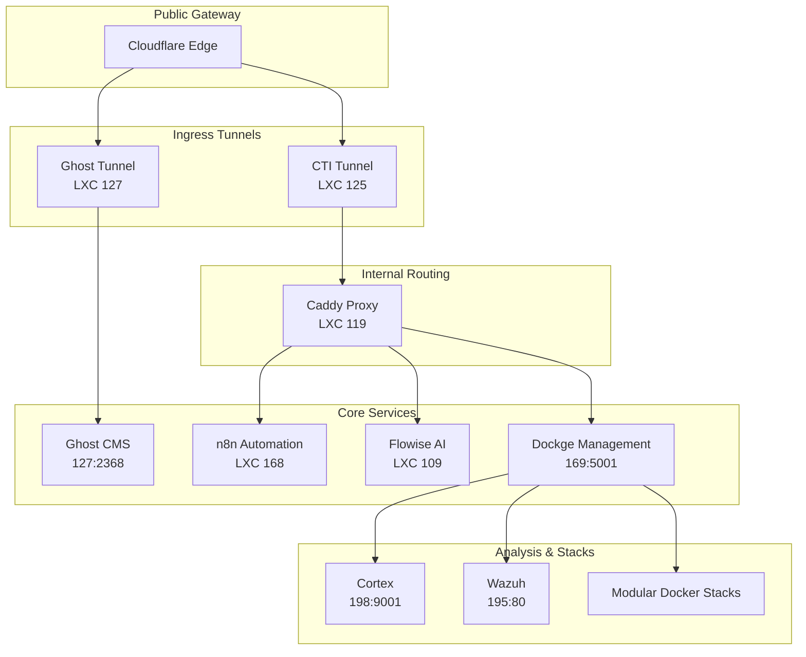

# ThreatLabs Homelab CTI Stack

A comprehensive Cyber Threat Intelligence (CTI) stack running on Docker, designed for homelab usage.

## Architecture

This repository is organized into modular stacks that share common infrastructure.



### Directory Structure

* **`infra/`**: **Core Infrastructure**. Hosts shared **ElasticSearch** (v7 & v8), **PostgreSQL 17**, and **Valkey** (Redis).
* **[Cloudflared Tunnel]**: Secure entry point for accessing services using Cloudflare Tunnels (replaced Traefik). (IP: `192.168.x.171`)
* **`misp-modules/`**: **Shared Enrichment**. Standalone MISP modules service used by both MISP and FlowIntel.
* **`xtm/`**: **Extended Threat Management**. Hosts OpenCTI, OpenAEV, and their connectors. Depends on `infra`.
* **`misp/`**: **Malware Information Sharing Platform**. Hosting MISP Core, Modules, and Guard.
* **`shuffle/`**: **SOAR**. Security Orchestration, Automation, and Response.
* **`flowintel/`**: **Case Management**. Lightweight alternative to TheHive.
* **`lacus/`**: **Crawling**. AIL Framework crawler (Playwright-based).
* **`thehive/`**: **Legacy Case Management**. TheHive 4, depends on `infra` (ES7).
* **`dfir-iris/`**: **Incident Response**. DFIR-IRIS collaborative IR platform (self-contained Postgres 12 + RabbitMQ).
* **`ail-project/`**: **Dark Web Analysis**. Instructions for deploying AIL Framework in a separate LXC.

### Shared Network

All stacks communicate via an external Docker network named `cti-net`.

### Documentation & Troubleshooting

For detailed architecture decisions, trade-offs, and troubleshooting steps, please refer to the **[Project Wiki](docs/Home.md)**:

*   **[Architecture & Decisions](docs/Architecture.md)**
*   **[Troubleshooting Guide](docs/Troubleshooting.md)**
*   **[Project Timeline](docs/Project-Timeline.md)**

> [!TIP]
> See [docs/Troubleshooting.md](docs/Troubleshooting.md) for network, permission, and common boot issues.

## Factory Reset

If you need to completely wipe the stack and start over (delete all data):

1. Run the reset script:

    ```bash
    chmod +x reset.sh
    ./reset.sh
    ```

2. Type `NUKE` when prompted.
3. Run `./setup.sh` to re-initialize the environment.

## Getting Started

### 1. Pre-requisites

Ensure Docker and Docker Compose are installed.

If cloning for the first time:

```bash
git clone --recurse-submodules https://github.com/JazenaYLA/threatlabs-cti-stack.git
```

(If you forgot `--recurse-submodules`, simply run `./setup.sh` and it will fix it).

### 2. (Optional) For Dockge Users

If you are managing your stacks with **Dockge**, you can use the `setup-dockge.sh` script to symlink these stacks into your Dockge directory (default `/opt/stacks`).

> [!NOTE]
> `setup.sh` is **MANDATORY** for everyone as it creates the necessary docker network (`cti-net`) and volumes.
> `setup-dockge.sh` is **OPTIONAL** and only for users who want to see these stacks in their Dockge dashboard.

```bash
sudo ./setup-dockge.sh
```

### 3. Configuration

Run the setup script to prepare networks, volumes, and generate environment files:

```bash
./setup.sh
```

**What the script does:**

1. Creates the shared network `cti-net`.
2. Creates necessary docker volumes.
3. **Generates `.env` files** for all stacks from templates.
    * For **OpenCTI (xtm)**, it automatically generates unique UUIDv4 tokens for all connectors.
4. **Pauses** to allow you to review and edit the generated `.env` files.

**Action Required:**
When the script pauses, open the `.env` files in each directory (e.g., `infra/.env`, `xtm/.env`) and set your specific secrets (passwords, API keys, domains).

> [!IMPORTANT]
>
> * **infra/.env**: Verify `ES_HEAP_SIZE_GB` fits your host's RAM.
>
* **xtm/.env**: Review generated UUIDs. If you are migrating an existing OpenCTI instance, you may need to replace these with your potential existing connector IDs.

1. Startup Order

The services must be started in a specific order to ensure database availability.

1. **Start Infrastructure Stack (REQUIRED FIRST)**

    * **CLI**: `cd infra && docker compose up -d`
    * **Dockge**: Go to `/opt/stacks` (Dashboard), select `infra`, and click **Active** / **Update**.

    *Wait for ElasticSearch clusters to be fully healthy.*

1. **Start Proxy (Optional but Recommended)**

    ```bash
    cd proxy && docker compose up -d
    ```

1. **Start Application Stacks**

    You can start the stacks in any order:

    * **OpenCTI / OpenAEV**: `cd xtm && docker compose up -d`
    * **MISP**: `cd misp && docker compose up -d`
    * **FlowIntel**: `cd flowintel && docker compose up -d`
    * **TheHive**: `cd thehive && docker compose up -d`
    * **DFIR-IRIS**: `cd dfir-iris && docker compose up -d`
    * **Lacus**: `cd lacus && docker compose up -d`
    * **AIL Project**: See [ail-project/README.md](ail-project/README.md) for deployment.
    * **Wazuh**: Deployed on independent instance (IP: 192.168.x.195).

## TheHive

### Initial Login Credentials
* **Username**: `admin@thehive.local`
* **Password**: `secret`

> [!IMPORTANT]
> Change the default password immediately after first login.

## DFIR-IRIS

Collaborative Incident Response platform. Accessible via **HTTPS** on port `4433` (configurable via `IRIS_HTTPS_PORT`).

### Initial Login Credentials
The administrator password is **randomly generated on first boot** and printed in the app container logs:
```bash
sudo docker logs iris-app 2>&1 | grep "create_safe_admin"
```

> [!IMPORTANT]
> The password is only printed once. Change it immediately and store it securely.
> To set a specific initial password, configure `IRIS_ADM_PASSWORD` in `.env` **before** first boot.

## FlowIntel

See [flowintel/README.md](flowintel/README.md) for full documentation.

### Initial Login Credentials
By default, the stack is configured to create an initial admin user:
* **Email**: `admin@admin.admin`
* **Password**: `admin`

You can change these **before the first run** by editing `flowintel/.env`:
```bash
INIT_ADMIN_EMAIL=your@email.com
INIT_ADMIN_PASSWORD=securepassword
```

> [!NOTE]
> If you have already started FlowIntel and want to change the initial admin:
> 1. Stop the container: `docker compose down`
> 2. Reset the database (see TROUBLESHOOTING.md)
> 3. Restart: `docker compose up -d`

### MISP Modules (Analyzers)

FlowinTel uses [MISP modules](https://www.misp-project.org/2024/03/12/Introducing.standalone.MISP.modules.html/) as its analyzer engine for enrichment. It **bundles its own `misp-modules` process** internally, so enrichment works out of the box.

To share API keys and custom modules with the rest of the stack, you can optionally point it to the shared `misp-modules-shared` instance — see [flowintel/README.md](flowintel/README.md#pointing-to-shared-instance-optional).

## MISP Modules

See [misp-modules/README.md](misp-modules/README.md) for full documentation.

Provides 200+ enrichment, expansion, import, and export modules as a shared service:
- **API** on port `6666` — used by MISP Core, FlowIntel, and any HTTP client
- **Web UI** on port `7008` — standalone interface for querying modules without a MISP instance

## Notes

* **Networks**: All stacks communicate via the `cti-net` Docker network. Create it with `docker network create cti-net` or let `setup.sh` handle it.
* **Stack READMEs**: Each stack directory has its own `README.md` with detailed configuration and troubleshooting.
* **Shared Infrastructure**: `infra/` provides PostgreSQL, Valkey, and ElasticSearch shared by multiple stacks. Always start it first.
* **Enrichment API Keys**: Configure enrichment API keys (VirusTotal, Shodan, etc.) in `misp-modules/.env` for centralized access.

