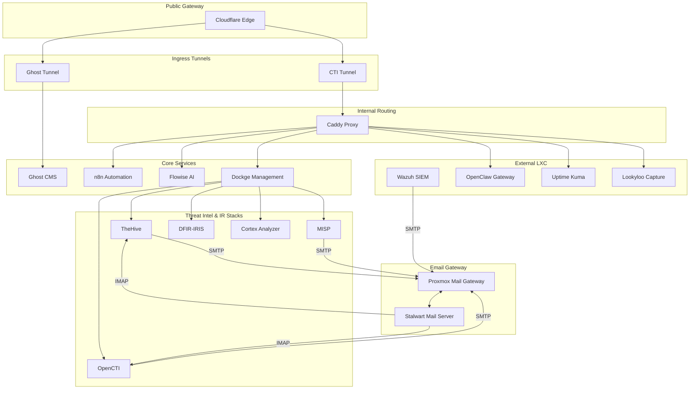
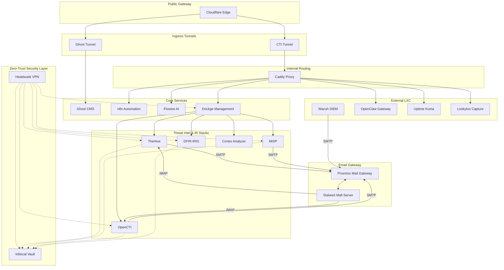

# Architecture & Decisions

This document chronicles the journey of integrating multiple Cyber Threat Intelligence (CTI) platforms—**TheHive**, **MISP**, **Lacus**, and **DFIR-IRIS**—into a unified, self-hosted homelab environment. It details the challenges, tradeoffs, and architectural decisions made to ensure these distinct stacks work together harmoniously.

## 🏗️ Deployment Models

The ThreatLabs CTI stack supports two distinct baseline deployments depending on your security requirements and operational maturity. These are physically tracked on separate Git branches to keep the codebase clean.

### 1. Homelab Model (`main` branch)

This is the "quick start" model designed for solo operators and home environments. It relies on standard `.env` files for secrets and simple Docker-native connectivity. Access is typically managed directly via SSH keys to the LXC containers or via a Cloudflared public proxy.

### 2. Enterprise Model (`enterprise` branch)

This is the advanced, zero-trust model designed for production environments or sophisticated labs. Rather than relying on static `.env` files, all CTI secrets are retrieved at deployment time using **Infisical** machine identities. Operator access to the backend infrastructure—and cross-VLAN communication for IoT integrations—is brokered via an encrypted, self-hosted **Headscale** Tailscale overlay rather than direct IP routing or exposed SSH ports.

## 🏗️ Shared Infrastructure

### The Network Challenge

**Goal**: Allow independent stacks to communicate (e.g., TheHive -> MISP, IRIS -> MISP) without exposing everything to the host network or creating a massive monolithic compose file.

**Solution**:  
We created a dedicated external Docker network, `cti-net`.

- **Decision**: All stacks define `cti-net` as `external: true`.
- **Tradeoff**: You must ensure the network exists (`docker network create cti-net`) before bringing up any stack.
- **Benefit**: Seamless service discovery by container name across stacks (e.g., `es7-cti` reachable by TheHive).

### Permission Management

**Challenge**: Different containers run as different users (Postgres=999, Elastic=1000, Root=0), causing "Permission Denied" errors on bind-mounted volumes.
**Solution**:  
Created `fix-permissions.sh`.

- **Logic**: Iterates through known data directories and forcefully applies the correct UID/GID (`chown -R`).
- **Automation**: Integrated into the setup process to ensure a clean start.

## 🧱 Stack-Specific Chronicles

For detailed technical changes, fixes, and version-specific modifications, refer to the individual changelogs:

- **[TheHive Changelog](thehive/CHANGELOG.md)**: Crash loops, Cortex integration, and storage fixes.
- **[MISP Changelog](misp/CHANGELOG.md)**: HTTPS redirect patches, database conflicts, and hook systems.
- **[Lacus Changelog](lacus/CHANGELOG.md)**: Build system rewrite, Playwright dependencies, and Redis integration.
- **[DFIR-IRIS Changelog](dfir-iris/CHANGELOG.md)**: Custom webhooks module build, database connectivity endurance, and certificate management.
- **[Wazuh Changelog](wazuh/CHANGELOG.md)**: Manual certificate generation, port conflict resolution (9202/5603), and Opensearch config patching.

## 🛡️ Stability & Isolation (Feb 2026 Update)

### The Action Runner Risk

**Challenge**: Automated deployments to the `main` branch were performing "destructive syncs," overwriting local `.env` fixes and causing unnecessary service restarts in production.

**Solution**:  
Implemented a **Branch-Aware Deployment Strategy**.

- **Isolation**: Created a separate filesystem root (`/opt/cti-dev`) for experimental work.
- **Logic**: Pushes to `auto-swapper` automatically sync to the dev root; pushes to `main` are decoupled from automatic automation.
- **Safety**: Production updates now require a manual `workflow_dispatch` trigger, ensuring that manual hotfixes and database states are preserved during normal development cycles.

## 🌐 Reverse Proxy Layer (Feb 2026 Update)

### The Stale IP Problem

**Challenge**: Every `.env` file referenced services by hardcoded IP (e.g., `http://<SERVICE_IP>:3000`). When VLANs were restructured or IPs changed, every stack broke silently — services cached the old addresses in registration files that persisted across restarts.

**Solution**:
Deployed **Caddy** as a centralized reverse proxy with domain-based routing.

- **Decision**: All inter-service URLs now use `*.lab.local` domains (e.g., `http://forgejo.lab.local`) via CNAME records pointing to Caddy.
- **Tradeoff**: Requires DNS infrastructure (we use Unifi's DNS) and adds Caddy as a dependency. Direct IPs still work for simple setups.
- **Benefit**: IP/VLAN changes only require updating one `A` record (Caddy's IP). All CNAME records and `.env` files remain unchanged.

### Self-Healing Registrations

Some services (notably the Forgejo runner) cache the server address at registration time in local files. We added **URL drift detection** to the runner's entrypoint — it compares the cached address against the environment variable on every start and automatically re-registers if they differ.

> [!NOTE]
> Both approaches (direct IP and Caddy proxy) are supported. See the [Reverse Proxy Guide](Reverse-Proxy-Guide.md) for setup and migration instructions.

## 📧 Email Orchestration & Hygiene (March 2026 Update)

### The "Service Account" Mailbox Problem

**Challenge**: Many CTI tools (TheHive, MISP, OpenCTI) require email for alerts or "email-to-case" features. Storing credentials for external mailboxes (Gmail/Outlook) inside every container is an OPSEC risk and a maintenance nightmare during password rotations.

**Solution**:
Deployed a two-tier internal email gateway using **PMG** and **Stalwart**.

- **Inbound Flow**: Cloudflare Email Routing -> Gmail -> **PMG** (Fetchmail) -> **Stalwart**.
  - PMG polls Gmail every 120s, filters for spam/malware, and delivers to Stalwart.
  - CTI tools fetch mail from local Stalwart IMAP mailboxes.
- **Outbound Flow**: CTI Stack -> **PMG** -> Gmail SMTP Relay.
  - Stacks treat PMG as a trusted internal relay (no auth needed from container side).
  - PMG handles the authenticated SASL connection to Gmail.

**Benefit**: Centralized credential management. If the master Gmail app password changes, you only update PMG, and every stack remains functional.

## 🚀 Summary of Tradeoffs

1. **Complexity vs. Isolation**: We chose **Shared Networking** over complete isolation. This simplifies integration (direct IP connectivity) but requires careful naming (DNS conflicts).
2. **Direct IPs vs. Reverse Proxy**: We migrated to **Caddy domain routing** for resilience. Direct IPs still work but are fragile across VLAN changes.
3. **Standards vs. Customization**: We modified upstream `docker-compose.yml` files significantly (flattened structures, added build steps). This means "git pull" updates from upstream require manual merging, but gives us a stable, tailored homelab environment.
4. **Security**: We generated self-signed certs for internal HTTPS. This requires trusting the CA in your browser but encrypts traffic on the wire.

---
*Created by Antigravity Assistant - Feb 2026*
