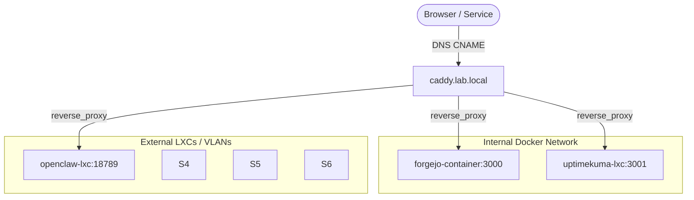

# Reverse Proxy Guide

This guide covers the CTI stack's transition from direct IP addressing to a Caddy reverse proxy with domain-based routing, and how to configure either approach.

## Why Reverse Proxy?

The stack originally used hardcoded IPs in every `.env` file. This worked but created a fragile configuration:

- **VLAN or IP changes** required updating every `.env` file across every stack (e.g., `http://10.0.0.50:3000`).
- **Cached registrations** (like the Forgejo runner's `.runner` file) silently kept using stale IPs.
- **No TLS termination** — each service handled its own HTTPS or ran plain HTTP.
- **No single ingress** — each service exposed its own port on the host.

Moving to Caddy gives us:
- **One place to update** when infrastructure changes (Caddy config + DNS).
- **Domain-based routing** (`service.lab.local`) that survives IP changes.
- **TLS termination** at the proxy layer.
- **Simplified firewall rules** — only expose ports 80/443 on Caddy.

## Two Approaches Compared

| Feature | **Direct IP** | **Caddy Proxy** |
|---|---|---|
| `.env` example | `http://<SERVICE_IP>:3000` | `http://forgejo.lab.local` |
| IP/VLAN change | Update every `.env` + restart all | Update Caddy config only |
| TLS | Per-service or none | Centralized at Caddy |
| DNS required | No | Yes (CNAME records) |
| Complexity | Lower initial setup | Requires Caddy + DNS |
| Resilience | Fragile | Robust |

> [!IMPORTANT]
> **Both approaches work.** Direct IPs are fine for simple setups. If you plan to change VLANs, IPs, or want centralized TLS, use the reverse proxy approach.

---

## Architecture: How It Works



1. **DNS**: Each service gets a CNAME record pointing to `caddy.lab.local`.
2. **Caddy**: Matches the hostname and reverse-proxies to the container/LXC.
3. **Internal Routing**: Docker services resolve each other by container name on the shared `cti-net` network.

### DNS Pattern

| Record | Type | Target |
|--------|------|--------|
| `forgejo.lab.local` | CNAME | `caddy.lab.local` |
| `opencti.lab.local` | CNAME | `caddy.lab.local` |
| `caddy.lab.local` | A | `<CADDY_IP>` |

> [!TIP]
> Only the `A` record for Caddy needs updating if Caddy's IP changes. All CNAME records stay the same.

---

## Configuration & Usage

### Setting Up Caddy for Docker Services (cti-net)

The Caddy proxy stack lives in `proxy/`. Caddy must be on `cti-net` to reach backend Docker services.

```bash
cd proxy && docker compose up -d
```

Example `Caddyfile` syntax for Docker routing:
```caddy
forgejo.lab.local {
    reverse_proxy forgejo-server:3000
}
```

### Migrating from Direct IPs

If you're switching an existing deployment from direct IPs to Caddy domains:

1. **Set up DNS** — create CNAME records pointing to `caddy.lab.local`.
2. **Update `.env` files** — replace IPs with domain names:
   ```diff
   - GITEA_INSTANCE_URL=http://<SERVICE_IP>:3000
   + GITEA_INSTANCE_URL=http://forgejo.lab.local
   ```
3. **Restart services** — `docker compose down && docker compose up -d`.
4. **Check for cached state** — see Gotchas below.

---

## Gotchas & Troubleshooting

### WebSocket & "Trust Proxy" Strictness
Some robust web applications (like **Uptime Kuma** or Matrix) rely heavily on WebSockets for real-time dashboards and have stricter proxy validation.
- **WebSockets**: Caddy handles WebSockets transparently by default (no special headers needed compared to Nginx).
- **Trust Proxy**: If the app fails to load or shows a "Cannot connect to the socket server" error, explicitly enable **"Trust Proxy"** in the app's settings. This forces the application to accept connection requests originating from Caddy's routing IP rather than rejecting them as spoofed direct clients.

### Cached Runner Registrations
The Forgejo runner stores the server address in `data/.runner` at registration time. Changing `GITEA_INSTANCE_URL` in `.env` does **not** update it.
- **Symptom**: `dial tcp <old-IP>:3000: no route to host`
- **Fix**: Delete `data/.runner` and restart, OR use the `entrypoint.sh` approach (see `forgejo-runner/README.md`) which includes **URL drift detection**.

### Services Not on `cti-net`
If a container isn't attached to `cti-net`, it can't resolve `*.lab.local` domains via Docker's internal DNS — it falls back to the host's DNS, which may resolve to an unreachable IP.
- **Fix**: Ensure every service that needs to reach other stacks has `networks: [cti-net]` in its compose file.

### Internal vs External URLs
Some services need **two different URLs**:
- **Internal** (container-to-container): `http://container-name:port` via `cti-net`
- **External** (browser/API access): `http://service.lab.local` via Caddy

> [!NOTE]
> Internal Docker DNS (`container-name:port`) is always the most reliable for container-to-container communication. Use Caddy domains for external access and cross-VLAN routing.

---

## Changing IPs or VLANs After Setup

With the reverse proxy approach, IP changes are localized:
1. **Caddy IP changed**: Update the single `A` record for `caddy.lab.local`.
2. **Service moved to new host**: Update the Caddyfile `reverse_proxy` target.
3. **VLAN restructured**: Update Caddy's network config; CNAME records stay the same.

## Reference
- [Forgejo Runner README](../forgejo-runner/README.md) — drift detection docs
- [Internal IPs](../internal_ips.md) — current IP mapping table
