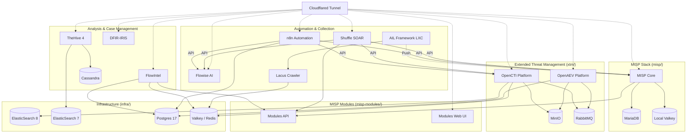

# ThreatLabs CTI Project Context Bundle

## 1. The Narrative Arc: Pitfalls & Discoveries
# Developer's Diary: The Pitfalls & Discoveries

*This section provides the "drama" and narrative arc for the blog post. It contrasts the clean "final" architecture with the messy reality of getting there.*

## 1. The "Simple" Network Fallacy
**Expectation**: "I’ll just spin up a few Docker Compose stacks and they’ll talk to each other."
**The Pitfall**: We quickly realized that independent stacks (TheHive, MISP, etc.) created their own isolated networks. They couldn’t resolve each other by hostname.
**The Drama**: We debated monolithic `docker-compose.yml` vs. isolated stacks. Monoliths are unmanageable; isolation breaks integration.
**The Discovery**: The "Shared External Network" pattern (`cti-net`). It required a mental shift: infrastructure comes *first*. We had to build the roads (`cti-net`) before we could build the houses.

## 2. The Permission Nightmare
**The Challenge**: Docker makes running services easy. Docker makes file permissions *hell*.
**The Pitfall**: Postgres runs as UID <ID>. ElasticSearch runs as UID <ID>0. Redis runs as... something else.
**The Struggle**: We experienced the classic "CrashLoopBackOff." Logs screamed `Permission denied`. We tried `chmod 777` (the shameful quick fix), but it felt wrong.
**The Insight**: We needed automation, not manual hacks. The creation of `fix-permissions.sh` was a turning point—a "janitor script" that runs before deployment to ensure every container has exactly the keys to the castle it needs, and nothing more.

## 3. The Infinite Loop of MISP
**The Scene**: MISP was up. We could see the login page. We typed credentials. Enter.
**The Horror**: The browser spun. And spun. "Too many redirects."
**The Investigation**: We spent hours debugging nginx configs. MISP thought it was on port 443. Traefik knew it was on port 8443. They couldn't agree on reality.
**The Discovery**: The `CORE_HTTPS_PORT` variable. It wasn't enough to just map the ports in Docker; we had to *tell* MISP's internal nginx that "Hey, the world sees you on port 8443, deal with it."

## 4. The Data Hoarder's Dilemma (ElasticSearch)
**The Trap**: ElasticSearch is hungry. By default, it wants to eat all RAM and map all memory.
**The Crash**: Services wouldn't start. The host slowed to a crawl. `OOM Killed`.
**The Discovery**: `vm.max_map_count`. The realization that running a CTI stack isn't just "running containers"—it's system administration. We had to tune the host kernel itself to support the massive indexing requirements of TheHive and Wazuh.

## 5. The Wazuh Fortress
**The Challenge**: "Let's add Wazuh for SIEM."
**The Pitfall**: Wazuh is paranoid (rightfully so). It refuses to talk to anyone without strict TLS authentication.
**The Drama**: The official cert tool failed. The default certs were for `localhost`. Our stack uses `wazuh.indexer` hostnames. Java threw `CertificateException` tantrums.
**The Triumph**: Use the source. We abandoned the automated tools and wrote our own `openssl` script (`generate-certs.sh`), hand-crafting the Subject Alternative Names (SANs). Controlling the cryptography ourselves turned a "black box" failure into a reliable security feature.

## 6. The Ghost in the Machine (Auto-Deployment)
**The Expectation**: "CI/CD will make our lives easier. Every commit automatically deploys."
**The Pitfall**: We forgot that the runner was blind. It pushed the `main` branch to the production root, but also pushed every experimental branch to the *same* root. 
**The Drama**: We'd fix a database password locally, commit a minor change, and—*poof*—the Action Runner would overwrite the working configuration with a templated one, breaking the stack again. We were fighting ourselves.
**The Discovery**: Environment Isolation. We had to build a second "staging" root and teach the runner to be branch-aware. Now, development happens in the sandbox, and production is guarded behind a manual trigger. CI/CD shouldn't just be *continuous*; it must be *context-aware*.

---
## 2. Project Overview (README.md)
# ThreatLabs Homelab CTI Stack

A comprehensive Cyber Threat Intelligence (CTI) stack running on Docker, designed for homelab usage.

## Architecture

This repository is organized into modular stacks that share common infrastructure.



### Directory Structure

* **`infra/`**: **Core Infrastructure**. Hosts shared **ElasticSearch** (v7 & v8), **PostgreSQL 17**, and **Valkey** (Redis).
* **[Cloudflared Tunnel]**: Secure entry point for accessing services using Cloudflare Tunnels (replaced Traefik). (IP: `192.168.x.171`)
* **`misp-modules/`**: **Shared Enrichment**. Standalone MISP modules service used by both MISP and FlowIntel.
* **`xtm/`**: **Extended Threat Management**. Hosts OpenCTI, OpenAEV, and their connectors. Depends on `infra`.
* **`misp/`**: **Malware Information Sharing Platform**. Hosting MISP Core, Modules, and Guard.
* **`shuffle/`**: **SOAR**. Security Orchestration, Automation, and Response.
* **`flowintel/`**: **Case Management**. Lightweight alternative to TheHive.
* **`lacus/`**: **Crawling**. AIL Framework crawler (Playwright-based).
* **`thehive/`**: **Legacy Case Management**. TheHive 4, depends on `infra` (ES7).
* **`dfir-iris/`**: **Incident Response**. DFIR-IRIS collaborative IR platform (self-contained Postgres 12 + RabbitMQ).
* **`ail-project/`**: **Dark Web Analysis**. Instructions for deploying AIL Framework in a separate LXC.

### Shared Network

All stacks communicate via an external Docker network named `cti-net`.

### Documentation & Troubleshooting

For detailed architecture decisions, trade-offs, and troubleshooting steps, please refer to the **[Project Wiki](docs/Home.md)**:

*   **[Architecture & Decisions](docs/Architecture.md)**
*   **[Troubleshooting Guide](docs/Troubleshooting.md)**
*   **[Project Timeline](docs/Project-Timeline.md)**

> [!TIP]
> See [docs/Troubleshooting.md](docs/Troubleshooting.md) for network, permission, and common boot issues.

## Factory Reset

If you need to completely wipe the stack and start over (delete all data):

1. Run the reset script:

    ```bash
    chmod +x reset.sh
    ./reset.sh
    ```

2. Type `NUKE` when prompted.
3. Run `./setup.sh` to re-initialize the environment.

## Getting Started

### 1. Pre-requisites

Ensure Docker and Docker Compose are installed.

If cloning for the first time:

```bash
git clone --recurse-submodules https://github.com/JazenaYLA/threatlabs-cti-stack.git
```

(If you forgot `--recurse-submodules`, simply run `./setup.sh` and it will fix it).

### 2. (Optional) For Dockge Users

If you are managing your stacks with **Dockge**, you can use the `setup-dockge.sh` script to symlink these stacks into your Dockge directory (default `/opt/stacks`).

> [!NOTE]
> `setup.sh` is **MANDATORY** for everyone as it creates the necessary docker network (`cti-net`) and volumes.
> `setup-dockge.sh` is **OPTIONAL** and only for users who want to see these stacks in their Dockge dashboard.

```bash
sudo ./setup-dockge.sh
```

### 3. Configuration

Run the setup script to prepare networks, volumes, and generate environment files:

```bash
./setup.sh
```

**What the script does:**

1. Creates the shared network `cti-net`.
2. Creates necessary docker volumes.
3. **Generates `.env` files** for all stacks from templates.
    * For **OpenCTI (xtm)**, it automatically generates unique UUIDv4 tokens for all connectors.
4. **Pauses** to allow you to review and edit the generated `.env` files.

**Action Required:**
When the script pauses, open the `.env` files in each directory (e.g., `infra/.env`, `xtm/.env`) and set your specific secrets (passwords, API keys, domains).

> [!IMPORTANT]
>
> * **infra/.env**: Verify `ES_HEAP_SIZE_GB` fits your host's RAM.
>
* **xtm/.env**: Review generated UUIDs. If you are migrating an existing OpenCTI instance, you may need to replace these with your potential existing connector IDs.

1. Startup Order

The services must be started in a specific order to ensure database availability.

1. **Start Infrastructure Stack (REQUIRED FIRST)**

    * **CLI**: `cd infra && docker compose up -d`
    * **Dockge**: Go to `/opt/stacks` (Dashboard), select `infra`, and click **Active** / **Update**.

    *Wait for ElasticSearch clusters to be fully healthy.*

1. **Start Proxy (Optional but Recommended)**

    ```bash
    cd proxy && docker compose up -d
    ```

1. **Start Application Stacks**

    You can start the stacks in any order:

    * **OpenCTI / OpenAEV**: `cd xtm && docker compose up -d`
    * **MISP**: `cd misp && docker compose up -d`
    * **FlowIntel**: `cd flowintel && docker compose up -d`
    * **TheHive**: `cd thehive && docker compose up -d`
    * **DFIR-IRIS**: `cd dfir-iris && docker compose up -d`
    * **Lacus**: `cd lacus && docker compose up -d`
    * **AIL Project**: See [ail-project/README.md](ail-project/README.md) for deployment.
    * **Wazuh**: Deployed on independent instance (IP: 192.168.x.195).

## TheHive

### Initial Login Credentials
* **Username**: `admin@thehive.local`
* **Password**: `secret`

> [!IMPORTANT]
> Change the default password immediately after first login.

## DFIR-IRIS

Collaborative Incident Response platform. Accessible via **HTTPS** on port `4433` (configurable via `IRIS_HTTPS_PORT`).

### Initial Login Credentials
The administrator password is **randomly generated on first boot** and printed in the app container logs:
```bash
sudo docker logs iris-app 2>&1 | grep "create_safe_admin"
```

> [!IMPORTANT]
> The password is only printed once. Change it immediately and store it securely.
> To set a specific initial password, configure `IRIS_ADM_PASSWORD` in `.env` **before** first boot.

## FlowIntel

See [flowintel/README.md](flowintel/README.md) for full documentation.

### Initial Login Credentials
By default, the stack is configured to create an initial admin user:
* **Email**: `admin@admin.admin`
* **Password**: `admin`

You can change these **before the first run** by editing `flowintel/.env`:
```bash
INIT_ADMIN_EMAIL=your@email.com
INIT_ADMIN_PASSWORD=securepassword
```

> [!NOTE]
> If you have already started FlowIntel and want to change the initial admin:
> 1. Stop the container: `docker compose down`
> 2. Reset the database (see TROUBLESHOOTING.md)
> 3. Restart: `docker compose up -d`

### MISP Modules (Analyzers)

FlowinTel uses [MISP modules](https://www.misp-project.org/2024/03/12/Introducing.standalone.MISP.modules.html/) as its analyzer engine for enrichment. It **bundles its own `misp-modules` process** internally, so enrichment works out of the box.

To share API keys and custom modules with the rest of the stack, you can optionally point it to the shared `misp-modules-shared` instance — see [flowintel/README.md](flowintel/README.md#pointing-to-shared-instance-optional).

## MISP Modules

See [misp-modules/README.md](misp-modules/README.md) for full documentation.

Provides 200+ enrichment, expansion, import, and export modules as a shared service:
- **API** on port `6666` — used by MISP Core, FlowIntel, and any HTTP client
- **Web UI** on port `7008` — standalone interface for querying modules without a MISP instance

## Notes

* **Networks**: All stacks communicate via the `cti-net` Docker network. Create it with `docker network create cti-net` or let `setup.sh` handle it.
* **Stack READMEs**: Each stack directory has its own `README.md` with detailed configuration and troubleshooting.
* **Shared Infrastructure**: `infra/` provides PostgreSQL, Valkey, and ElasticSearch shared by multiple stacks. Always start it first.
* **Enrichment API Keys**: Configure enrichment API keys (VirusTotal, Shodan, etc.) in `misp-modules/.env` for centralized access.


---
## 3. Project Timeline & Story
# Project Story & Timeline

This document chronicles the timeline of our **ThreatLabs CTI** project, detailing the orchestration, challenges, and integration of various security tools.

## Timeline

### 📅 Feb 19, 2026: Environment Isolation & Stabilization
- **Action Runner**: Isolate runner environments. Implemented branch-aware logic to separate Production (/opt/stacks) from Development (/opt/cti-dev).
- **Stability**: Disabled automatic production deployments to prevent destructive synchronization and unnecessary restarts.
- **Restoration**: Successfully restored full stack health across MISP, TheHive, and XTM after deep database/volume recovery.
- **Documentation**: Finalized Wiki and root documentation to capture technical lessons on permissions and healthchecks.

### 📅 Feb 15, 2026: Wazuh Deployment & Standardization
- **Wazuh Stack**: Deployed Wazuh for SIEM/XDR capabilities. Addressed certificate generation and port mapping issues.
- **Standardization**: Standardized `.env.example` naming across all stacks to ensure consistency.
- **Documentation**: Initiated this Wiki to track the project story and timeline, inspired by similar open-source security projects.

### 📅 Feb 14, 2026: Lacus & MISP Improvements
- **Lacus**: Fixed build issues related to Playwright browser downloads and Redis connectivity.
- **MISP**: Resolved HTTPS redirect issues by making the nginx configuration aware of custom ports.

### 📅 Feb 11, 2026: Vaultwarden & Cortex
- **Vaultwarden**: Deployed Vaultwarden for password management, integrated with Traefik.
- **Cortex**: Debugged and resolved a restart loop caused by Elasticsearch connection and indexing issues.

### 📅 Feb 09, 2026: Automation & Refinements
- **Permissions**: Created `fix-permissions.sh` to automate ownership fixes for persistent volumes (Postgres/Valkey).
- **Git**: Committed initial stable configurations to the repository.

### 📅 Feb 08, 2026: OpenClaw & Documentation
- **OpenClaw**: Configured Traefik proxy for OpenClaw LXC, adding security headers and IP whitelisting.
- **Docs**: Updated `README.md` and `TROUBLESHOOTING.md` with deployment instructions.

---
*Generated by Antigravity Assistant*

---
## 4. Architecture & Decisions
# Architecture & Decisions

This document chronicles the journey of integrating multiple Cyber Threat Intelligence (CTI) platforms—**TheHive**, **MISP**, **Lacus**, and **DFIR-IRIS**—into a unified, self-hosted homelab environment. It details the challenges, tradeoffs, and architectural decisions made to ensure these distinct stacks work together harmoniously.

## 🏗️ Shared Infrastructure

### The Network Challenge
**Goal**: Allow independent stacks to communicate (e.g., TheHive -> MISP, IRIS -> MISP) without exposing everything to the host network or creating a massive monolithic compose file.

**Solution**:  
We created a dedicated external Docker network, `cti-net`.
- **Decision**: All stacks define `cti-net` as `external: true`.
- **Tradeoff**: You must ensure the network exists (`docker network create cti-net`) before bringing up any stack.
- **Benefit**: Seamless service discovery by container name across stacks (e.g., `es7-cti` reachable by TheHive).

### Permission Management
**Challenge**: Different containers run as different users (Postgres=999, Elastic=1000, Root=0), causing "Permission Denied" errors on bind-mounted volumes.
**Solution**:  
Created `fix-permissions.sh`.
- **Logic**: Iterates through known data directories and forcefully applies the correct UID/GID (`chown -R`).
- **Automation**: Integrated into the setup process to ensure a clean start.

## 🧱 Stack-Specific Chronicles

For detailed technical changes, fixes, and version-specific modifications, refer to the individual changelogs:

- **[TheHive Changelog](thehive/CHANGELOG.md)**: Crash loops, Cortex integration, and storage fixes.
- **[MISP Changelog](misp/CHANGELOG.md)**: HTTPS redirect patches, database conflicts, and hook systems.
- **[Lacus Changelog](lacus/CHANGELOG.md)**: Build system rewrite, Playwright dependencies, and Redis integration.
- **[DFIR-IRIS Changelog](dfir-iris/CHANGELOG.md)**: Custom webhooks module build, database connectivity endurance, and certificate management.
- **[Wazuh Changelog](wazuh/CHANGELOG.md)**: Manual certificate generation, port conflict resolution (9202/5603), and Opensearch config patching.

## 🛡️ Stability & Isolation (Feb 2026 Update)

### The Action Runner Risk
**Challenge**: Automated deployments to the `main` branch were performing "destructive syncs," overwriting local `.env` fixes and causing unnecessary service restarts in production.

**Solution**:  
Implemented a **Branch-Aware Deployment Strategy**.
- **Isolation**: Created a separate filesystem root (`/opt/cti-dev`) for experimental work.
- **Logic**: Pushes to `auto-swapper` automatically sync to the dev root; pushes to `main` are decoupled from automatic automation.
- **Safety**: Production updates now require a manual `workflow_dispatch` trigger, ensuring that manual hotfixes and database states are preserved during normal development cycles.

## 🚀 Summary of Tradeoffs

1.  **Complexity vs. Isolation**: We chose **Shared Networking** over complete isolation. This simplifies integration (direct IP connectivity) but requires careful naming (DNS conflicts).
2.  **Standards vs. Customization**: We modified upstream `docker-compose.yml` files significantly (flattened structures, added build steps). This means "git pull" updates from upstream require manual merging, but gives us a stable, tailored homelab environment.
3.  **Security**: We generated self-signed certs for internal HTTPS. This requires trusting the CA in your browser but encrypts traffic on the wire.

---
*Created by Antigravity Assistant - Feb 2026*

---
## 5. Troubleshooting & Challenges
# Troubleshooting Guide

This guide addresses common issues encountered when deploying the ThreatLabs CTI stack on virtualization/Dockge.

## Quick Checks Sequence

If something isn't working, check these in order:

1. **Network Check**: Is `cti-net` active?

    ```bash
    docker network ls | grep cti-net
    ```

    *Fix*: Run `./setup.sh` or `docker network create cti-net`.

2. **Persistence Permissions**:
    * **ElasticSearch**: Requires UID `1000`.
    * **PostgreSQL**: Alpine-based version 17 requires UID `70` (not `999`).
    * **Cassandra**: Requires UID `999`.
    * *Fix*: `sudo chown -R <UID>:<UID> vol/<service-data>`.

3. **Infrastructure Health**: Are ElasticSearch nodes ready?

    ```bash
    curl http://localhost:9200/_cluster/health?pretty  # ES7
    curl http://localhost:9201/_cluster/health?pretty  # ES8
    ```

    *Fix*: Restart `infra` stack. Check `vm.max_map_count` on host.

3. **Permissions**: Are volumes owning the right user?
    *Description*: Services crash with "Permission denied".
    *Fix*: Run `./setup.sh` to apply recursive ownership to `./vol` directories.

## Common Error Messages

### `service "..." refers to undefined network cti-net`

**Cause**: The stack cannot see the shared network, or it's named incorrectly in `docker-compose.yml`.
**Solution**:

1. Ensure the `infra` stack is started (it creates `cti-net`).
2. Verify `docker-compose.yml` has:

   ```yaml
   networks:
     cti-net:
       external: true
       name: cti-net
   ```

### ElasticSearch exits with `max virtual memory areas vm.max_map_count [...] is too low`

**Cause**: Host kernel limit is too low for ES.
**Solution**:

```bash
sudo sysctl -w vm.max_map_count=262144
# To make permanent:
echo "vm.max_map_count=262144" | sudo tee -a /etc/sysctl.conf
```

### Dockge cannot find `xtm` or `thehive` stacks

**Cause**: Dockge may not index subdirectories recursively.
**Solution**: Symlink the compose files to the root stacks directory.

```bash
cd /opt/stacks
ln -s /path/to/repo/xtm/docker-compose.yml xtm
ln -s /path/to/repo/thehive/docker-compose.yml thehive
```

### MISP feed fetch is stuck / Queue full

**Cause**: Initial fetch of all feeds can overload workers.
**Solution**:

1. Increase workers in **Administration > Server Settings > Workers**.
2. Restart workers: `sudo supervisorctl restart all` (inside container).

### Healthcheck Access Denied (Internal DB)

**Cause**: The `misp-core` healthcheck uses `.env` credentials. If they mismatch the `infra` DB settings, the container stays "Unhealthy".
**Fix**: Ensure `MYSQL_USER`/`PASS` in `misp/.env` matches `infra/.env`.

### Database Connection Failures (Shared Infra)

**Issue**: Services like `n8n`, `xtm` (OpenAEV), or `flowintel` fail to start with database auth errors.

**Cause**: Mismatch between the credentials created by `infra` and what is configured in your `.env`.

**Check**:

1. Verify `infra` is running and healthy (`infra-postgres`).
2. Check the logs of the failing service (`docker logs n8n-cti`). If you see "password authentication failed":
    * Compare your local `.env` (e.g., `n8n/.env`) against the defaults in `infra/vol/postgres-init/init-dbs.sh` or `infra/.env` variables.
    * **Fix**: Update your `.env` to match the expected credentials (e.g., ensure `N8N_DB_PASSWORD` in `n8n/.env` matches `infra/.env`).

### "Factory Reset" Needed

**Issue**: The stack is in an undefined state, volumes are corrupted, or you just want to start over.

**Fix**: Use the provided nuking script.

1. Run `./reset.sh`.
2. Type `NUKE` to confirm.
3. Run `./setup.sh` to recreate the directory structure and permissions.

## Specific Stack Issues

### "Secret Key" Errors (TheHive)

**Issue**: Service logs show errors about `play.http.secret.key` or fails to start with configuration errors.

**Cause**: The application secret key is missing or invalid. We now use environment variables (`THEHIVE_SECRET`) instead of hardcoding them in `application.conf`.

**Fix**:

1. Check `thehive/.env` for `THEHIVE_SECRET`.
2. Ensure `docker-compose.yml` passes this variable to the container.

### AIL Project

* **Issue**: Redis continuously restarts/crashes in independent instances.
* **Cause**: ZFS file system incompatibility with Redis persistence.
* **Fix**: Disable `use_direct_io_for_flush_and_compaction` in `redis.conf`. See `ail-project/README.md` for the full fix.

### TheHive

* **Issue**: TheHive cannot connect to ElasticSearch.
* **Check**: TheHive 4 requires **ElasticSearch 7**.
* **Fix**: Ensure `es7-cti` service in `infra` is healthy and env `ES_HOSTS` points to `es7-cti:9200`.

* **Issue**: TheHive crash-loops with `NoSuchFileException: /opt/thp/thehive/data`.
* **Cause**: Missing volume mount for local file storage.
* **Fix**: Ensure `docker-compose.yml` mounts the data directory:
    ```yaml
    volumes:
      - ./vol/thehive/application.conf:/etc/thehive/application.conf:ro
      - ./vol/thehive/data:/opt/thp/thehive/data
    ```
    Then create the directory: `sudo mkdir -p thehive/vol/thehive/data && sudo chown -R 1000:1000 thehive/vol`

### DFIR-IRIS

* **Issue**: Cannot find the administrator password.
* **Cause**: The admin password is randomly generated and printed in the `iris-app` logs only on the very first boot.
* **Fix**: Search the logs:
    ```bash
    sudo docker logs iris-app 2>&1 | grep "create_safe_admin"
    ```
    To set a specific password, configure `IRIS_ADM_PASSWORD` in `dfir-iris/.env` **before** first boot.

* **Issue**: IRIS shows certificate errors or nginx won't start.
* **Cause**: Self-signed certificates are missing from `certificates/web_certificates/`.
* **Fix**: Run `./setup.sh` to auto-generate certificates, or manually:
    ```bash
    cd dfir-iris
    mkdir -p certificates/{rootCA,web_certificates,ldap}
    openssl req -x509 -nodes -days 3650 -newkey rsa:2048 \
      -keyout certificates/web_certificates/iris_dev_key.pem \
      -out certificates/web_certificates/iris_dev_cert.pem \
      -subj "/CN=iris.local"
    ```

### FlowIntel
 
* **Issue**: Initial admin credentials not working or want to change them.
* **Cause**: FlowIntel by default hardcodes `admin@admin.admin` / `admin` in `init_db.py`.
* **Fix**:
    1. Update `flowintel/.env` with desired `INIT_ADMIN_EMAIL` and `INIT_ADMIN_PASSWORD`.
    2. Reset the database to force re-initialization (WARNING: DATA LOSS):

    ```bash
    # Stop Container
    docker compose -f flowintel/docker-compose.yml down
    
    # Drop and Recreate DB (in infra-postgres)
    docker exec infra-postgres psql -U postgres -d postgres -c "DROP DATABASE IF EXISTS flowintel;"
    docker exec infra-postgres psql -U postgres -d postgres -c "CREATE DATABASE flowintel;"
    docker exec infra-postgres psql -U postgres -d postgres -c "GRANT ALL PRIVILEGES ON DATABASE flowintel TO flowintel;"
    docker exec infra-postgres psql -U postgres -d flowintel -c "GRANT ALL ON SCHEMA public TO flowintel;"
    
    # Restart to trigger entrypoint patch and init
    docker compose -f flowintel/docker-compose.yml up -d
    ```
    
    *Note: The `entrypoint.sh` includes a python script that patches `app/utils/init_db.py` at runtime to enforce your environment variables.*

### OpenCTI
 
* **Issue**: Connectors not showing up or "rabbitmq" connection refused.
* **Check**: Is the shared RabbitMQ in `xtm` healthy?
* **Fix**: Check `xtm` logs: `docker compose logs -f rabbitmq`.

* **Issue**: `VALIDATION_ERROR` — `"input.id" is null` in OpenCTI logs (`RegisterConnector` operation).
* **Cause**: One or more connector services defined in `docker-compose.yml` have a blank `CONNECTOR_*_ID` env var (commented out in `.env` but the service is still active).
* **Fix**: Either:
    1. Uncomment the connector ID in `.env` and generate a valid UUIDv4, or
    2. Comment out the corresponding service definition in `docker-compose.yml`.

### OpenAEV

* **Issue**: OpenAEV logs show `"Response body does not conform to a GraphQL response"` or `"Unexpected response for request on: /"`.
* **Cause**: `OPENAEV_XTM_OPENCTI_API_URL` is pointing to `http://opencti:8080` (root, returns HTML frontend) instead of the GraphQL endpoint.
* **Fix**: Change the API URL in `docker-compose.yml`:
    ```yaml
    # WRONG:
    - OPENAEV_XTM_OPENCTI_API_URL=http://opencti:8080
    # CORRECT:
    - OPENAEV_XTM_OPENCTI_API_URL=http://opencti:8080/graphql
    ```

### OpenCTI Schema Conflict (ElasticSearch 8)

**Symptoms**: `opencti` container loop or mapping errors in ES8 logs.
**Cause**: Legacy indices from failed installs preventing clean start.
**Fix**: Stop XTM, wipe ES8 data (`sudo rm -rf infra/vol/es8/data/*`), and restart.

* **Issue**: OpenAEV connector fails to register — `"input.id" is null` in OpenCTI logs but `OPENAEV_XTM_OPENCTI_ID` appears to be set.
* **Cause**: `OPENAEV_XTM_OPENCTI_ID` is missing from `.env` or not passed through `docker-compose.yml`.
* **Fix**: Ensure `.env` contains `OPENAEV_XTM_OPENCTI_ID=<valid-uuidv4>` and `docker-compose.yml` maps it:
    ```yaml
    - OPENAEV_XTM_OPENCTI_ID=${OPENAEV_XTM_OPENCTI_ID}
    ```

* **Issue**: PostgreSQL `Permission denied` errors in `infra-postgres` (especially after volume changes).
* **Cause**: The Alpine-based Postgres 17 image uses UID `70` (not `999`). If data directory ownership doesn't match, Postgres can't start.
* **Fix**: Run permissions fix:
    ```bash
    sudo chown -R 70:70 /opt/stacks/infra/vol/postgres-data
    ```

### MISP Modules
* **Issue**: Enrichment fails in MISP or FlowIntel.
* **Check**: ensure `misp-modules` stack is running and healthy: `curl http://localhost:6666/modules`.
* **Fix**: Check logs `docker logs misp-modules-shared`. Ensure `MISP_MODULES_FQDN` is set in `misp/docker-compose.yml` and `MISP_MODULES_URL` is set in `flowintel/docker-compose.yml`.

* **Issue**: Web UI shows "Instance of misp-modules is unreachable".
* **Cause**: The `misp-modules-web` container started before the API was healthy, or the API crashed.
* **Fix**: Restart the web UI: `docker compose restart misp-modules-web` (in `misp-modules/`). The `depends_on: service_healthy` should prevent this normally.

* **Issue**: Web UI returns `ValueError: SECRET_KEY must be set in .env`.
* **Fix**: Set `SECRET_KEY` in `misp-modules/.env`. Generate with: `openssl rand -hex 16`.

* **Issue**: FlowIntel enrichment fails but `misp-modules-shared` is healthy.
* **Cause**: FlowIntel bundles its own `misp-modules` process on `127.0.0.1:6666`. If the internal process dies, enrichment fails even though the shared instance is fine.
* **Check**: `docker exec flowintel-cti curl -s http://127.0.0.1:6666/modules | head -c 50`
* **Fix**: Restart flowintel: `docker compose restart flowintel` (in `flowintel/`).

---
## 6. Global Changelog
# Project Changelog

Tracking high-level modifications and standardization efforts across the ThreatLabs CTI project.

## [Unreleased]

### Added
- **Docs**: Created `docs/` directory formatted as a Forgejo Wiki (`Home.md`, `Project-Timeline.md`, `Changelog.md`).
- **Docs**: Added `docs/` to `.gitignore` to keep it local for now.
- **Standardization**: Added `.env.example` files for `wazuh` and `misp` stacks.
- **Standardization**: Renamed root `.env.sample` to `.env.example`.

### Changed
- **Wazuh**: Standardized environment variables.
- **MISP**: Standardized environment variables.

### [2026-02-19]

#### Added
- **Environment Isolation**: Implemented a dual-root strategy (/opt/stacks for PROD, /opt/cti-dev for DEV) to prevent environment cross-contamination.
- **Action Runner**: Implemented branch-aware deployment logic in `deploy.yml`:
  - `auto-swapper` branch -> Automatic deployment to `/opt/cti-dev`.
  - `main` branch -> Automatic production deployment **DISABLED** for safety.
- **Runner Configuration**: Added volume mount for `/opt/cti-dev` to the Forgejo Runner.
- **Documentation**: Formalized technical lessons on MISP healthchecks, Cassandra permissions, and ElasticSearch schema recovery.

#### Fixed
- **MISP**: Resolved internal healthcheck 403 failures by aligning application and database credentials.
- **TheHive**: Fixed Cassandra startup loop via recursive UID <ID> ownership fix on data volumes.
- **XTM**: Resolved OpenCTI schema conflicts via deep ElasticSearch 8 data wipe and re-initialization.
- **Infrastructure**: Fixed shared database initialization by wiping legacy Postgres volumes.

